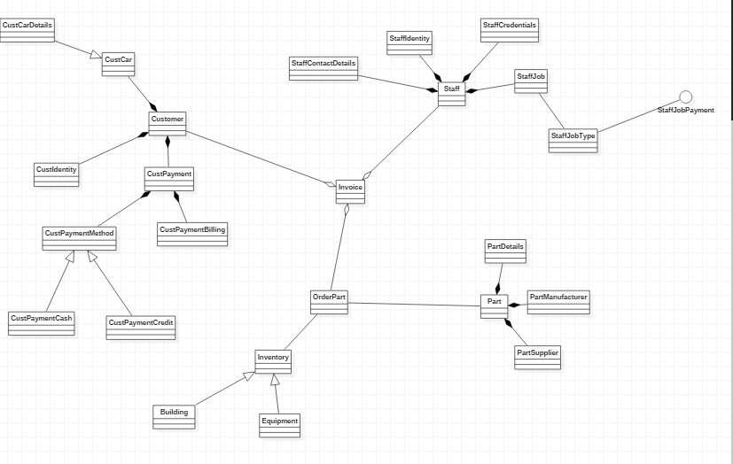

# CarPartsStore (CPS)

CPS is a maven project that simulates the operation of a car parts retailer.
Operations includes procurement of parts, POS system, Staff identification, etc.

## Visuals

## Contributing

Pull requests are welcome. For major changes, please open an issue first to discuss what you would like to change.

Please make sure to update tests as appropriate.

## Project Status

The project is still a snapshot
